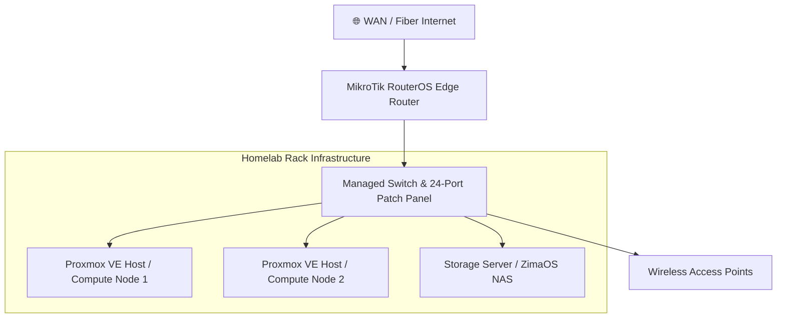

### 🌐 Physical Hardware Topology

---

### Hardware Specifications

| Component | Role | Function & Hardware Details |
| :--- | :--- | :--- |
| **Edge Router** | Gateway / Firewall | MikroTik RouterOS running edge routing, static lease mapping, and custom firewall rules. |
| **Switching** | Core Switching | Netgear M4100 Managed Layer 2/3 Switch + 24-Port Patch Panel for VLAN distribution and trunking. |
| **Hypervisors** | Compute Nodes | Dual Proxmox VE hosts running virtualized Debian/Rocky Linux VMs, LXCs, and Docker container stacks. |
| **Storage Node** | NAS / Storage | ZimaOS NAS server managing storage pools, localized apps, and network shares. |
| **Access Layer** | Wireless APs | Plasma Cloud PAX1800AX access points configured for local network coverage and VLAN SSID tagging. |
---

### Network Architecture & Segmentation

| VLAN ID | Network Name | Subnet | Purpose & Security Scope |
| :--- | :--- | :--- | :--- |
| **VLAN 10** | Management & Core | `172.30.0.0/23` | Proxmox hypervisors, switch management, RouterOS admin, core servers, compute LXCs, and local DNS |
| **Native / Untagged** | Trusted LAN | `192.168.8.0/24` | Primary workstations, laptops, and trusted personal LAN devices |
| **VLAN 20** | IoT Devices | `192.168.88.0/24` | Isolated smart home and wireless IoT hardware managed via Plasma Cloud APs |
| **VLAN 30** | Guest Network | `192.168.188.0/27` | Restricted guest wireless access and isolated transient devices |

### Active Hosted Services

| Category | Service | Container / Host | Description |
| :--- | :--- | :--- | :--- |
| **Networking & Ingress** | Nginx | Docker VM | Edge reverse proxy with automated SSL certificate renewal |
| **Access & Security** | Tailscale | LXC Container | Zero-trust overlay mesh network for remote node access subnet router | 
| **Infrastructure Ops** | Uptime Kuma | Docker VM | Live ping monitoring, service uptime tracking, and alerting |
| **Data Management** | ZimaOS / Samba | NAS Host | Centralized storage pools and LAN network shares |
| **Security & Secrets** | Vaultwarden | Docker VM | Self-hosted encrypted password vault |
