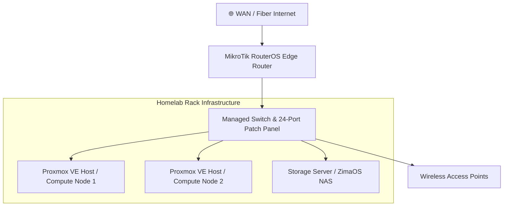

### 🌐 Physical Hardware Topology

---

### Hardware Specifications

| Component | Role | Function & Hardware Details |
| :--- | :--- | :--- |
| **Edge Router** | Gateway / Firewall | MikroTik RouterOS running edge routing, static lease mapping, and custom firewall rules. |
| **Switching** | Core Switching | Netgear M4100 Managed Layer 2/3 Switch + 24-Port Patch Panel for VLAN distribution and trunking. |
| **Hypervisors** | Compute Nodes | Dual Proxmox VE hosts running virtualized Debian/Rocky Linux VMs, LXCs, and Docker container stacks. |
| **Storage Node** | NAS / Storage | ZimaOS NAS server managing storage pools, localized apps, and network shares. |
| **Access Layer** | Wireless APs | Plasma Cloud PAX1800AX access points configured for local network coverage and VLAN SSID tagging. |
