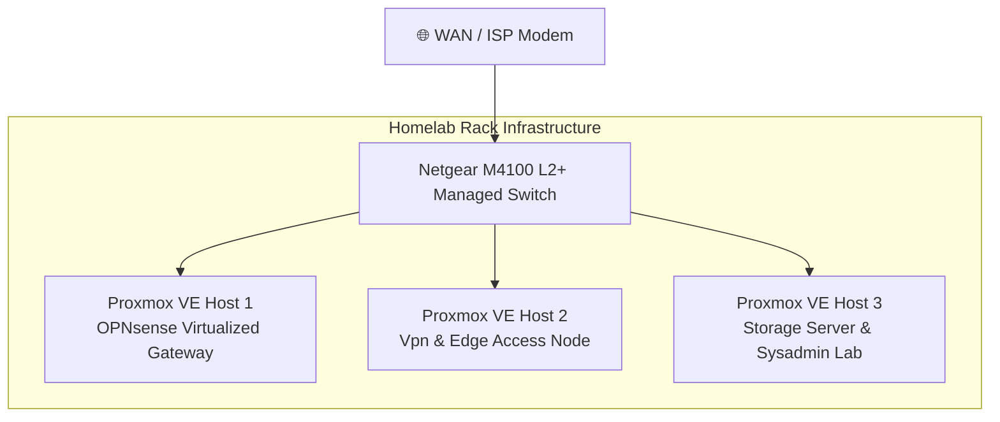

### 🌐 Physical Hardware Topology

How the Setup Works
I built this homelab to keep network traffic strictly separated while getting the most out of virtualized hardware. Here is how each part operates:

Hardware WAN Isolation (Netgear M4100 Switch): Fiber internet comes directly into Port 25 on the Netgear M4100 switch. Port 25 sits on its own isolated VLAN (VLAN 99) with every unused port disabled so raw internet traffic can't leak into the local network. It passes out of Port 26 over a tagged 802.1Q trunk straight into the firewall host.

Virtualized Firewall & Single-NIC Routing (Proxmox Host 1): Instead of using a dedicated physical router, I run OPNsense in a VM on a dedicated mini PC. Using Proxmox's vmbr0 bridge and VLAN tags, I split one physical network card into two virtual interfaces—one for WAN (VLAN 99) and one for untagged LAN. OPNsense treats them like two separate physical network cards, handling all routing, NAT, and firewall rules.

Reverse Proxy & Remote Access (Proxmox Host 2): This node handles inbound access. It runs an Nginx LXC for reverse proxying and SSL certs, along with a Tailscale LXC for secure, zero-trust remote access back into the lab. I also use this host as a staging ground to test new Docker/LXC setups before deploying them.

Storage, Services & Sysadmin Lab (Proxmox Host 3): This host handles heavy compute and core infrastructure:

Storage NAS VM: Has direct disk passthrough for raw drive access and fast file sharing.

Docker Engine (Debian VM): Runs all production container stacks.

Enterprise Lab (Rocky Linux & Windows Server VMs): A Rocky Linux VM for RHEL-family CLI administration practice, and a Windows Server VM running Active Directory, Group Policy (GPO), and RDP to mirror enterprise IT environments.
